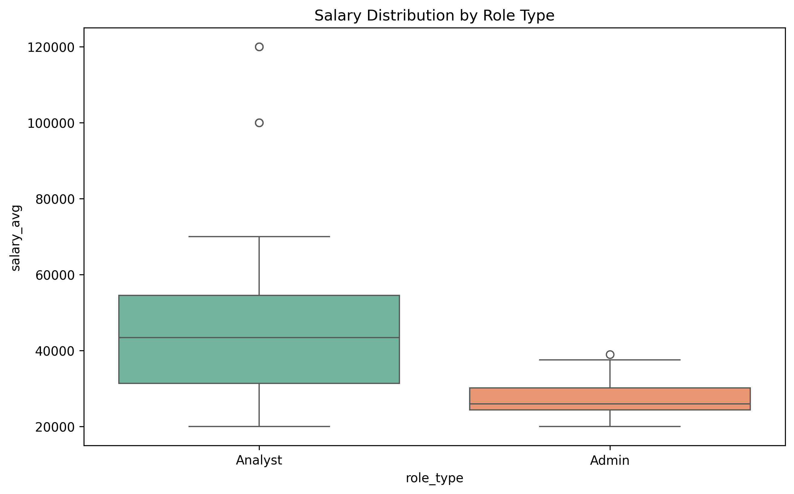
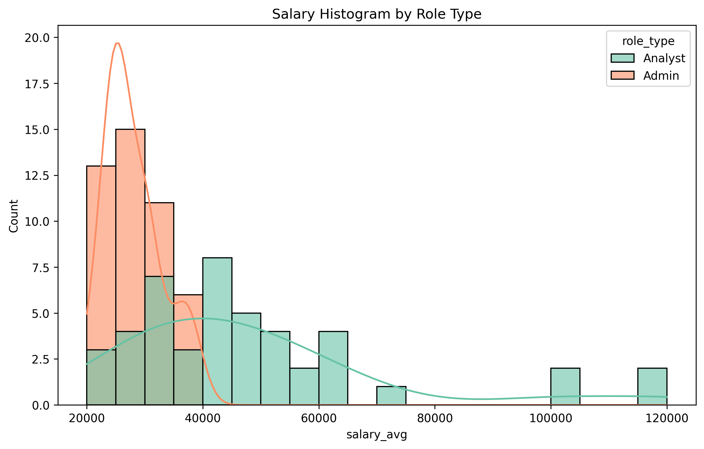
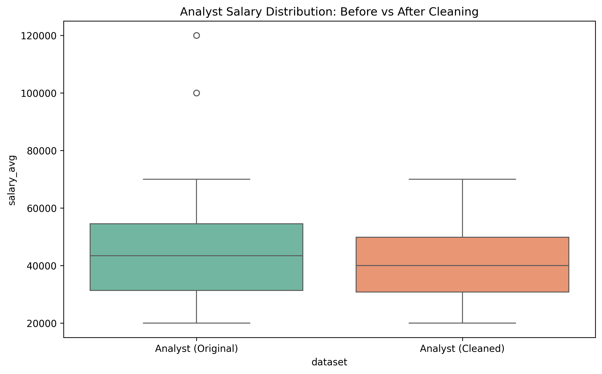
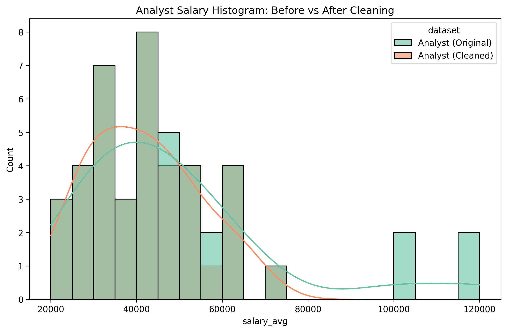
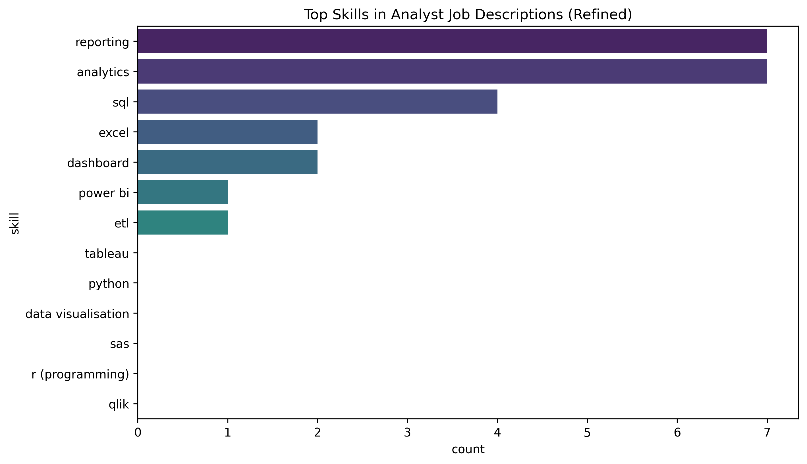
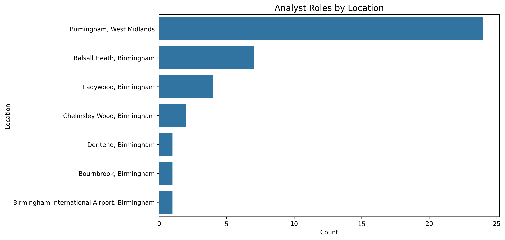
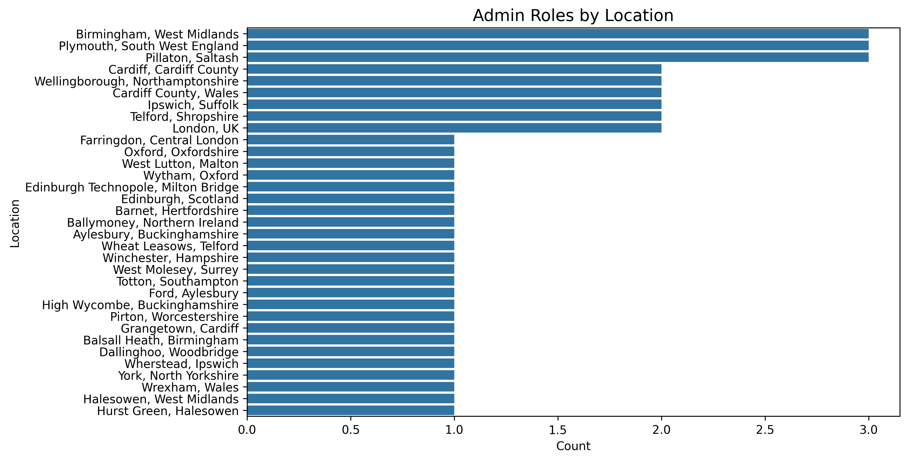

# 📊 Job Search Analysis App

This project automates the search, cleaning, and analysis of job postings for **Data Analyst** and **Admin** roles.  
The notebook walks through the full workflow step by step, and all outputs (CSVs + charts) are saved in the [`outputs/`](./outputs) folder.

---

## 🚀 Workflow Overview

### 1. Data Collection
- Job postings pulled via API and pre-processed into structured DataFrames.
- Separate pipelines for Analyst and Admin roles.

---

### 2. Cleaning & Ranking
- `filter_and_rank()` applies scoring logic and optional training filters.
- `remove_outlier_roles()` removes senior/misclassified postings.
- Deduplication ensures unique role–company pairs.

➡️ **Outputs:**  
- [⬇️ Analyst deduplicated salaries (CSV)](./outputs/analyst_deduplicated_salaries.csv)  
- [⬇️ Admin deduplicated salaries (CSV)](./outputs/admin_deduplicated_salaries.csv)  

---

### 3. Salary Analysis
- Mean/median salary calculations.
- Outlier detection (5th/95th percentile).
- Before/after cleaning comparisons.

➡️ **Outputs:**  
  
  
  
  

---

### 4. Top Roles
- Ranked by score and salary.
- Exported shortlists for quick reference.

➡️ **Outputs:**  
- [⬇️ Top 5 Analyst roles (CSV)](./outputs/top5_analyst_roles.csv)  
- [⬇️ Top 5 Admin roles (CSV)](./outputs/top5_admin_roles.csv)  

---

### 5. Skills Frequency
- `refined_skill_frequency()` uses regex to count mentions of key tools (Excel, Power BI, SQL, Python, etc.).
- Separate charts for Analyst and Admin roles.

➡️ **Outputs:**  
  
  

---

### 6. Location Insights
- Countplots of job postings by location.
- Highlights regional demand.

➡️ **Outputs:**  
  
  

---

## 🧰 Tech Stack
- **Python**: pandas, seaborn, matplotlib, regex
- **Jupyter Notebook**: analysis & documentation
- **Git/GitHub**: version control & reproducibility

---

## ⚙️ How to Run
# Clone the repository
git clone https://github.com/Leonw98/job_search_app.git
cd job_search_app

# (Optional) Create and activate a virtual environment
python -m venv venv
# On Windows:
venv\Scripts\activate
# On macOS/Linux:
source venv/bin/activate

# Install dependencies
pip install -r requirements.txt

# Launch Jupyter Notebook
jupyter notebook notebook.ipynb
